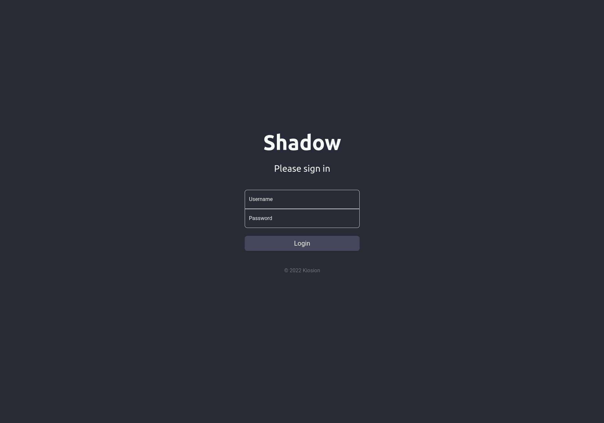
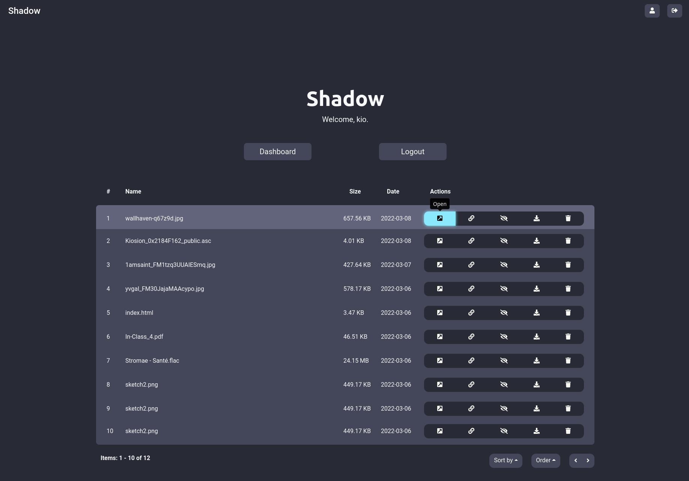
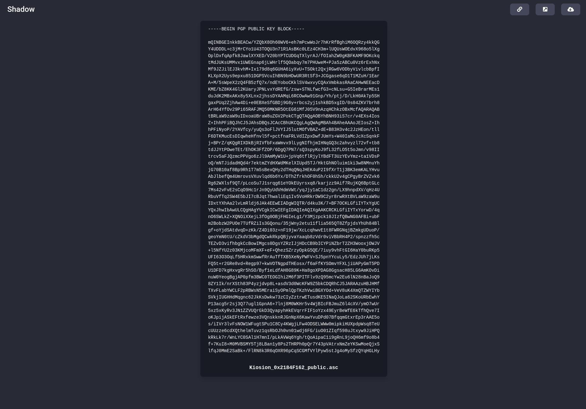
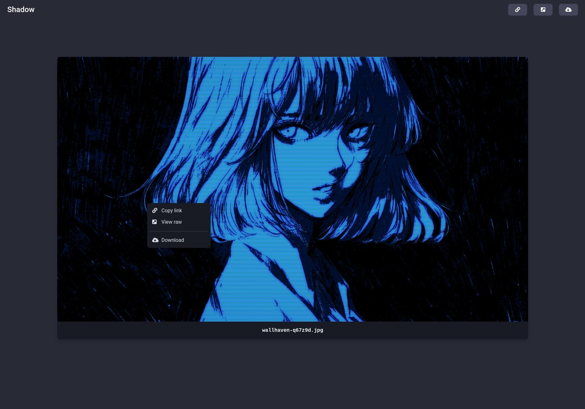
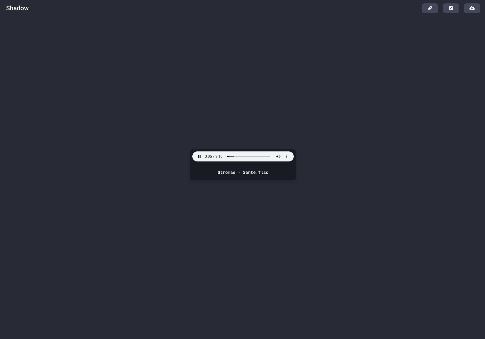

	<h1>Shadow</h1>
	
A simple PHP file manager for uploading / sharing content and images.

### ABOUT
I wasn't happy with any self-hosted file manager / file sharing solution out there, so I created my own! Shadow is still very much a work-in-progress, so feel free to contribute if you're knowledgeable with PHP, JS, SQL, or creating similar solutions.

#### Features:
- Supports any file format, but images, videos, and text files will display a preview in the web UI
- Beautiful & easy-to-navigate interface with custom context menus, dropdowns, and colour themes
- Image/video files embed nicely with Twitter, Discord, Telegram and other socials
- User & file managment with customizable permissions
- Privacy settings for uploads - Public, private, or registered users only
- API supports direct downloads, uploads, and fetching user/file info
- More to come as I work on this project over the next few months :)

### SCREENSHOTS

#### Sign-in page:
</img>
#### Dashboard:
</img>
#### Text file preview:
</img>
#### Image file preview:
</img>
#### Audio file preview:
</img>

### INSTALL
Install instructions & install script are a WIP :)

### DEPS
- PHP 8.1.2
- MariaDB 10.4.22

### TODO
Read [TODO.md](TODO.md).
